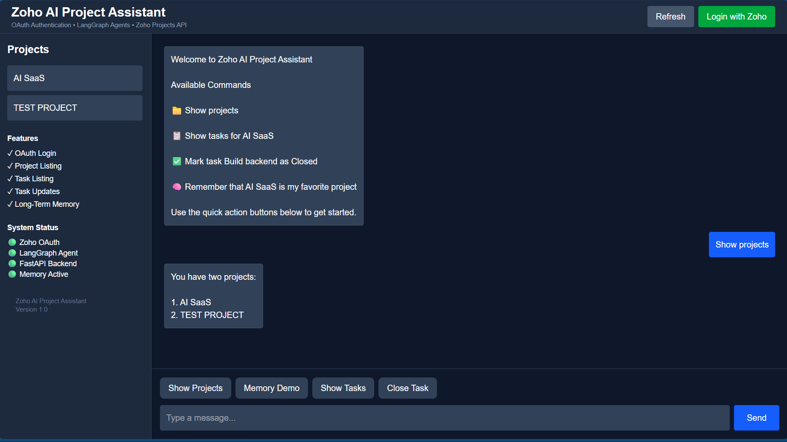

# Zoho AI Project Assistant

AI-powered project management assistant built using **React, FastAPI, LangGraph, Groq, and Zoho Projects API**.

## Features

### Authentication

- Zoho OAuth Login
- Session-based authentication
- Secure API access
- Human-in-the-Loop Confirmation for Task Updates

### Query Agent

- List Projects
- List Tasks
- Natural language project queries

### Action Agent

- Update Task Status
- Conversational task management

### User Interface

- Modern React dashboard
- Chat-based interaction
- Quick Action buttons
- Loading indicators

---

## Architecture

```text
User
  ↓
React Frontend
  ↓
FastAPI Backend
  ↓
LangGraph Agent
  ↓
Zoho Projects API
```

---

## Screenshots

### LOGIN


### Dashboard


### TASKS




---

## Supported Conversation Flows

### Flow 1 — Show Projects

User:

```text
Show projects
```

Assistant:

```text
AI SaaS
TEST PROJECT
```

### Flow 2 — Show Tasks

User:

```text
Show tasks for AI SaaS
```

Assistant returns project tasks.

### Flow 3 — Update Task Status

User:

```text
Mark task Build backend as Closed
```

Assistant updates task status using Zoho Projects API.

### Flow 4 — Verify Update

User:

```text
Show tasks for AI SaaS
```

Assistant returns updated status.

---

## Technology Stack

Frontend:

- React
- Axios
- Tailwind CSS

Backend:

- FastAPI
- LangGraph
- SQLModel

AI:

- Groq LLM

External Integrations:

- Zoho OAuth
- Zoho Projects API

---

## Setup Instructions

### Backend

```bash
pip install -r requirements.txt
uvicorn app.main:app --reload
```

### Frontend

```bash
npm install
npm run dev -- --host 127.0.0.1
```

---

## Known Limitations

- Project creation workflow is under development.
- Human-in-the-loop confirmation workflow planned for future enhancement.
- Human-in-the-loop confirmation workflow partially implemented.
- Long-term memory infrastructure implemented using persistent storage, with further conversational memory improvements planned.

---

## Author

Shreyanshi Singh
